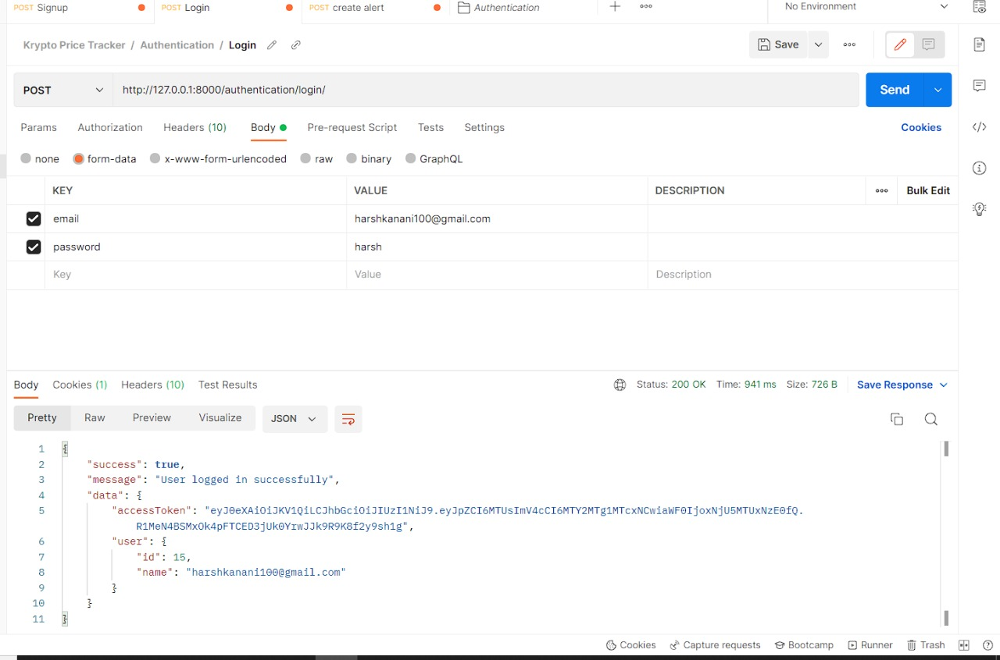
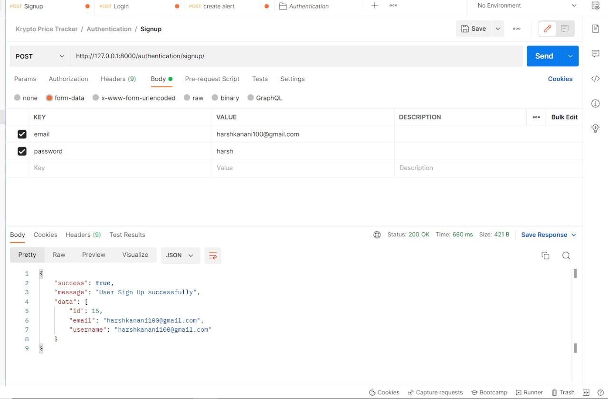
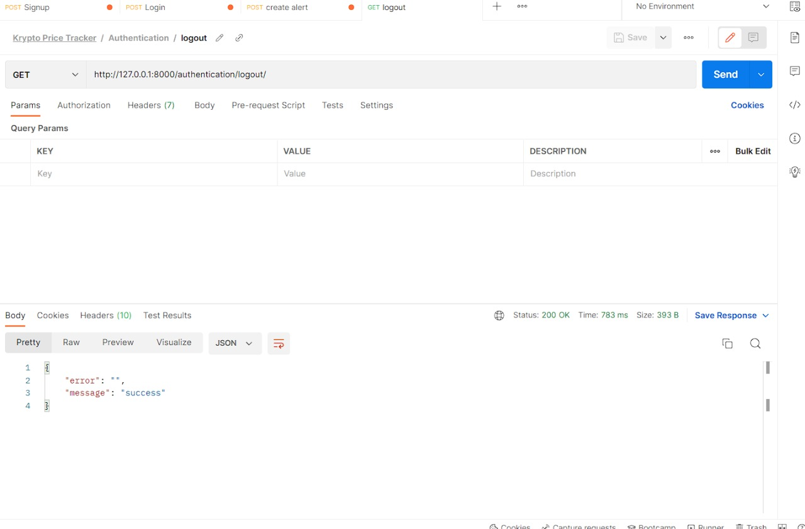
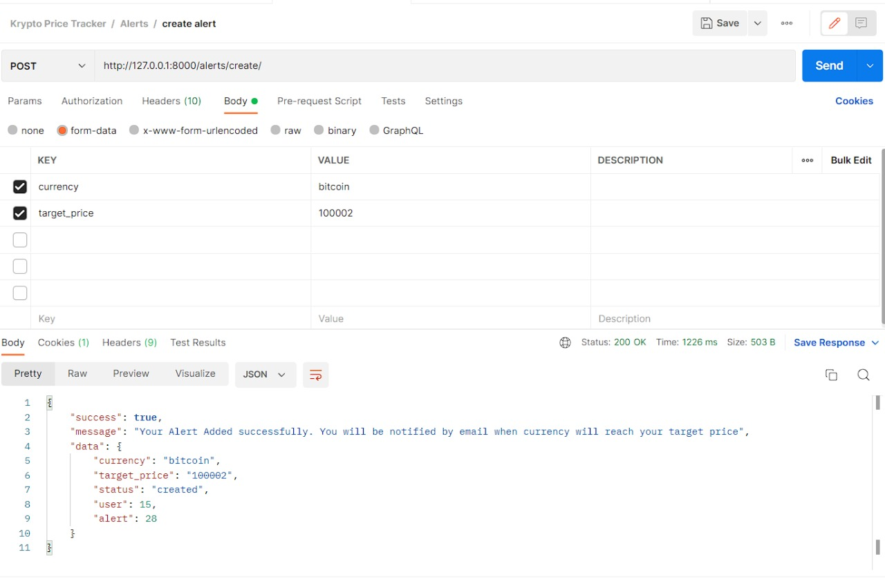
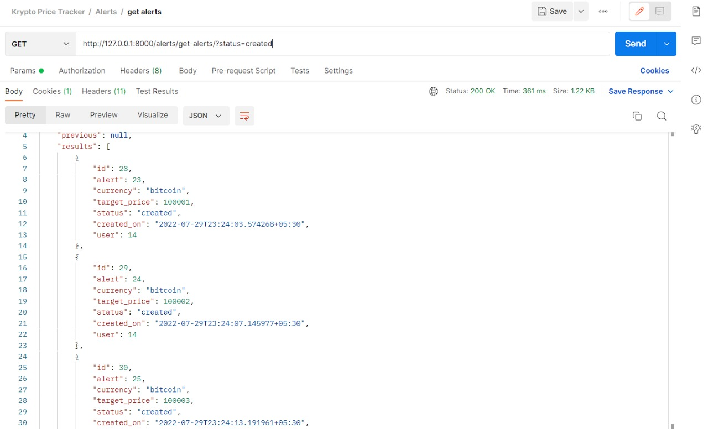
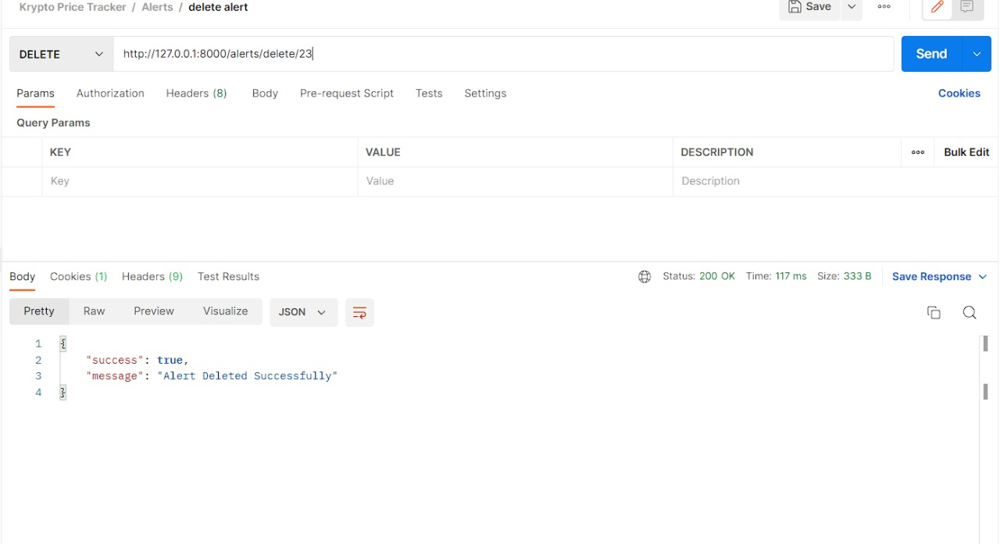
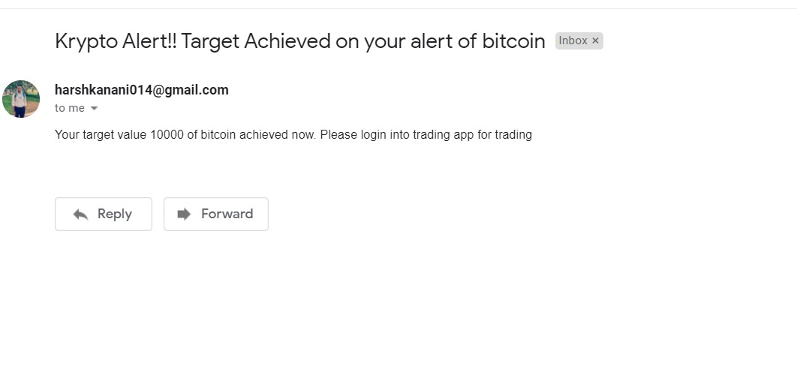

<div id="top"></div>


<!-- PROJECT SHIELDS -->
<!--
*** I'm using markdown "reference style" links for readability.
*** Reference links are enclosed in brackets [ ] instead of parentheses ( ).
*** See the bottom of this document for the declaration of the reference variables
*** for contributors-url, forks-url, etc. This is an optional, concise syntax you may use.
*** https://www.markdownguide.org/basic-syntax/#reference-style-links
-->
<!--
[![LinkedIn][linkedin-shield]][linkedin-url]
-->


<br />
<div align="center">

<h3 align="center">Krypto Price Tracker</h3>

  <p align="center">
    Price tracker API to get an alert when target for given cryptocurrency is reached.
    <br />
    <a href="https://github.com/harshkanani014/krypto-price-tracker/issues">Report Bug</a>
    ·
    <a href="https://github.com/harshkanani014/krypto-price-tracker/issues">Request Feature</a>
  </p>
</div>


<!-- TABLE OF CONTENTS -->
<details>
  <summary>Table of Contents</summary>
  <ol>
    <li>
      <a href="#about-the-project">About The Project</a>
      <ul>
        <li><a href="#built-with">Built With</a></li>
      </ul>
    </li>
    <li>
      <a href="#getting-started">Installation & Setup</a>
    </li>
    <li><a href="#usage">Usage</a></li>
    <li><a href="#output">Output</a></li>
    <li><a href="#contributing">Contributing</a></li>
    <li><a href="#contact">Contact</a></li>
  </ol>
</details>


<!-- ABOUT THE PROJECT -->
## About The Project

Krypto Price Tracker API allows users to keep track of their favourite crypto currency price target with flexible feature
to add alerts with all crypto currency available and target value. User will get notified by email if current price is equal to 
the target price. As target is achieved user will recieve email with all details regarding alert created.

### Krypto Price Tracker provides the following features:

1. User Authentication Functionalities with jwt token which includes signup and login functionalities. 
2. User can create alert by choosing his purchased crypto currency and target price to keep track on it.
3. User can delete already created alert.
4. Email will be triggered to user's email id when target price is achieved by current price of crypto currency.
5. User can fetch all alerts with filter on status and currency
6. Pagination on all alerts list
7. Multiple cryptocurrency supported
8. Optimized task scheduling
7. Optimized fetching of all alerts using caching

<p align="right">(<a href="#top">back to top</a>)</p>


### Built With

* [Python](https://www.python.org/)

### Framework Used
* [Django](https://www.djangoproject.com/)

### Database used
* [Postgre SQL](https://www.postgresql.org/)

### Libraries used

* [Django Rest Framework](https://www.django-rest-framework.org/)
* [Celery](https://docs.celeryq.dev/en/stable/django/first-steps-with-django.html)
* [Celery-beat]()
* [Redis (message broker)]()
* [psycopg2]()

### Standard Format
1. Code Format - PEP-8 (python standard format)
2. API format - REST based

### Tools Used :
1. Postman (for API testing and API documentation)
2. Git
3. Github
4. VScode

### Third Party API Used :
1. https://api.coingecko.com/api/v3/coins/markets?vs_currency=USD&order=market_cap_desc&per_page=100&page=1&sparkline=false

<p align="right">(<a href="#top">back to top</a>)</p>

### Postman collection link
https://www.getpostman.com/collections/f1d52156aadc40745fcc


<!-- GETTING STARTED -->
## Getting Started

This is an example of how you may give instructions on setting up your project locally.
To get a local copy up and running follow these simple steps.

### Prerequisites

This is an example of how to list things you need to use and how to install them.
* python [https://www.python.org/downloads/]
* pip
  ```sh
  python3 -m pip install --upgrade pip
  ```
### Database Setup
1. Install PostgreSQl with pgAdmin
##### Download postgreSQL from following link and install
##### https://www.enterprisedb.com/downloads/postgres-postgresql-downloads

2. Set Up Database
##### Open PgAdmin and Create a database with name as per choice in PgAdmin.

### Redis Setup
1. Download and Install redis .msi file on windows.
##### https://github.com/microsoftarchive/redis/releases

2. For Installing Redis on linux
```sh
  https://redis.io/docs/getting-started/installation/install-redis-on-linux/
 ```

3. Start redis
```sh
  redis-server
```
 
### Steps to Run code on your Local setup
1. Clone a repo
2. Create and Activate virtual environment 
    ```sh
    py -m venv <env-name>
    ```
  
    ```sh
    <env-name>\Scripts\activate.bat
    ```

3. Install All libraries using requirements.txt
   ```sh
   pip install -r requirements.txt
   ```

4. Go to krypto-price-tracker/settings.py
```sh
  DATABASES = {
    'default': {
        'ENGINE': 'django.db.backends.postgresql',
        'NAME': 'your-database-name',
        'USER': 'your-user-name',
        'PASSWORD': 'your-password',
        'HOST': 'localhost'
    }
  } 
```

5. For setting up SMTP goto krypto-price-tracker/settings.py and add email with password

```sh
EMAIL_HOST_USER = "xyz@gmail.com"
EMAIL_HOST_PASSWORD = "your password"
```

6. Perform migrations and migrate
```sh
  python manage.py makemigrations
```

```sh
  python manage.py migrate
```

7. Start Django Server
```sh
  python manage.py runserver
```

8. Start Celery Server
```sh
celery -A krypto_price_tracker worker -l info -P gevent
```

9. Start Celery Worker
```sh
celery -A krypto_price_tracker beat --loglevel=debug --scheduler django_celery_beat.schedulers:DatabaseScheduler
```

### Usage

#### STEP-1 : 
         User can sign up by using API (http://127.0.0.1:8000/authentication/signup/) Arguement : email and password needed
         Json Data required in Post request
         {
            "email":"",
            "password:""
         }
#### STEP-2 : 
         User can login using API (http://127.0.0.1:8000/authentication/login/)
          {
            "email":"",
            "password:""
         }
#### STEP-3 : 
         Now User can add alert with current name and target value in USD using API (http://127.0.0.1:8000/alerts/create/)
         So Task is assigned to celery through message broker redis which run at every 10 seconds and fetch current price
         of coin from third party API used and checks if the user alert price is achieved or not. And If user alert price 
         is achieved then email is triggred to user registered email id with alert details.
         {
            "currency":"",
            "target_price":""
         }
#### STEP-4 :
         User can delete alert using API (http://127.0.0.1:8000/alerts/delete/id)
#### STEP-5 : 
         User can fetch all alerts details with pagination and filter such as status, user and currency using
         API (http://127.0.0.1:8000/alerts/get-alerts/?page=x&status=x&currency=x&user=x)
   

<p align="right">(<a href="#top">back to top</a>)</p>

## Output:
 ### Authentication:
 ###### Login
  
  
 ###### Signup
  
  
 ###### Logout
  
  
 ### Alerts:
 ###### Create
  
  
 ###### Get
  
  
 ###### Delete
  

 ### Email:
  

See the [open issues](https://github.com/harshkanani014/krypto-price-tracker/issues) for a full list of proposed features (and known issues).

<p align="right">(<a href="#top">back to top</a>)</p>


<!-- CONTRIBUTING -->
## Contributing

Contributions are what make the open source community such an amazing place to learn, inspire, and create. Any contributions you make are **greatly appreciated**.

If you have a suggestion that would make this better, please fork the repo and create a pull request. You can also simply open an issue with the tag "enhancement".
Don't forget to give the project a star! Thanks again!

1. Fork the Project
2. Create your Feature Branch (`git checkout -b feature/AmazingFeature`)
3. Commit your Changes (`git commit -m 'Add some AmazingFeature'`)
4. Push to the Branch (`git push origin feature/AmazingFeature`)
5. Open a Pull Request

<p align="right">(<a href="#top">back to top</a>)</p>


<!-- CONTACT -->
## Contact

Your Name - Harsh Kanani (19BCE2562)- harshkanani014@gmail.com

Project Link: [https://github.com/harshkanani014/krypto-price-tracker](https://github.com/harshkanani014/krypto-price-tracker)

<p align="right">(<a href="#top">back to top</a>)</p>


<!-- MARKDOWN LINKS & IMAGES -->
<!-- https://www.markdownguide.org/basic-syntax/#reference-style-links -->
[contributors-shield]: https://img.shields.io/github/contributors/github_username/repo_name.svg?style=for-the-badge
[contributors-url]: https://github.com/github_username/repo_name/graphs/contributors
[forks-shield]: https://img.shields.io/github/forks/github_username/repo_name.svg?style=for-the-badge
[forks-url]: https://github.com/github_username/repo_name/network/members
[stars-shield]: https://img.shields.io/github/stars/github_username/repo_name.svg?style=for-the-badge
[stars-url]: https://github.com/github_username/repo_name/stargazers
[issues-shield]: https://img.shields.io/github/issues/github_username/repo_name.svg?style=for-the-badge
[issues-url]: https://github.com/github_username/repo_name/issues
[license-shield]: https://img.shields.io/github/license/github_username/repo_name.svg?style=for-the-badge
[license-url]: https://github.com/github_username/repo_name/blob/master/LICENSE.txt
[linkedin-shield]: https://img.shields.io/badge/-LinkedIn-black.svg?style=for-the-badge&logo=linkedin&colorB=555
[linkedin-url]: https://www.linkedin.com/in/harsh-kanani-69a45818b/
[product-screenshot]: images/screenshot.png
